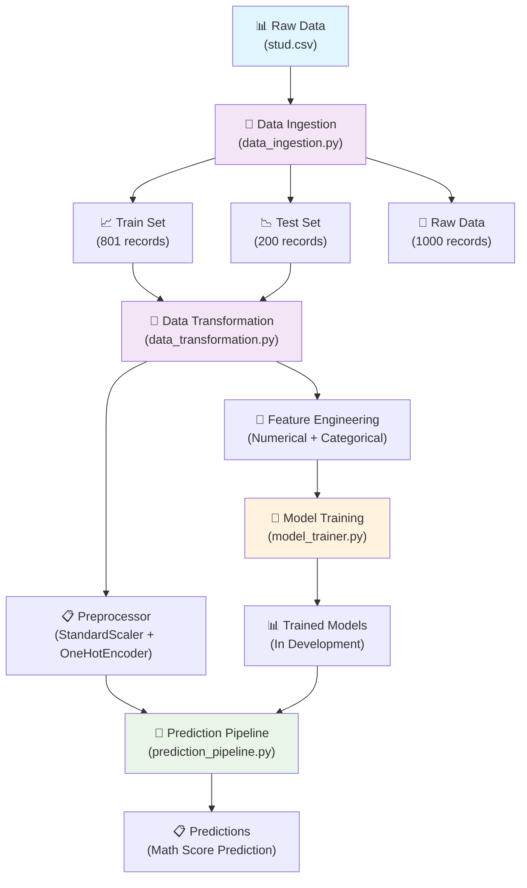

# 🎓 Student Performance Prediction - End-to-End ML Project

[](https://www.python.org/downloads/)
[](https://scikit-learn.org/)
[](https://pandas.pydata.org/)
[](https://github.com/jagadeesh/mlproject)

> A comprehensive machine learning project that predicts student math scores based on various demographic and educational factors. This project demonstrates end-to-end ML pipeline implementation with industry best practices.

## 📊 Project Overview

This project analyzes student performance data to predict math scores using various features such as:
- **Demographics**: Gender, Race/Ethnicity
- **Educational Background**: Parental education level, Test preparation course completion
- **Socioeconomic Factors**: Lunch type (free/reduced vs standard)
- **Academic Performance**: Reading and Writing scores

### 🎯 Key Objectives
- Build a robust prediction system for student math performance
- Implement modular, reusable ML pipeline components
- Demonstrate professional software engineering practices in ML
- Create comprehensive data preprocessing and feature engineering pipeline

## 🏗️ Project Architecture



## 📁 Project Structure

```
project/
├── 📂 src/                          # Source code
│   ├── 📂 components/               # ML Pipeline Components
│   │   ├── 📄 data_ingestion.py    ✅ # Data loading & splitting
│   │   ├── 📄 data_transformation.py ✅ # Feature engineering
│   │   └── 📄 model_trainer.py     🔄 # Model training (In Progress)
│   ├── 📂 pipeline/                 # ML Pipelines
│   │   ├── 📄 train_pipeline.py    🔄 # Training workflow
│   │   └── 📄 prediction_pipeline.py 🔄 # Inference workflow
│   ├── 📄 exception.py             ✅ # Custom exception handling
│   ├── 📄 logger.py                ✅ # Logging configuration
│   └── 📄 utils.py                 ✅ # Utility functions
├── 📂 notebooks/                    # Jupyter Notebooks
│   ├── 📄 1. EDA STUDENT PERFORMANCE.ipynb ✅
│   ├── 📄 2. MODEL TRAINING.ipynb  ✅
│   └── 📂 data/
│       └── 📄 stud.csv             # Original dataset (1,000 records)
├── 📂 artifacts/                    # Generated files
│   ├── 📄 raw.csv                  # Processed raw data (1,001 records)
│   ├── 📄 train.csv                # Training set (801 records)
│   └── 📄 test.csv                 # Test set (200 records)
├── 📂 logs/                         # Application logs
├── 📄 requirements.txt              # Project dependencies
├── 📄 setup.py                     # Package configuration
└── 📄 README.md                    # Project documentation
```

## 🔧 Technical Implementation

### ✅ Completed Components

#### 1. **Data Ingestion Pipeline** (`src/components/data_ingestion.py`)
- **Functionality**: Automated data loading, validation, and train-test splitting
- **Features**:
  - Robust error handling with custom exceptions
  - Configurable file paths using dataclass
  - 80-20 train-test split with fixed random state
  - Cross-platform path handling
- **Output**: Generates `train.csv`, `test.csv`, and `raw.csv` in artifacts directory

#### 2. **Data Transformation Pipeline** (`src/components/data_transformation.py`)
- **Functionality**: Comprehensive feature engineering and preprocessing
- **Features**:
  - **Numerical Pipeline**: Median imputation + Standard scaling
  - **Categorical Pipeline**: Most frequent imputation + One-hot encoding + Scaling
  - **Target Variable**: Math score prediction
  - **Feature Categories**:
    - Numerical: `reading_score`, `writing_score`
    - Categorical: `gender`, `race_ethnicity`, `parental_level_of_education`, `lunch`, `test_preparation_course`

#### 3. **Infrastructure & Utilities**
- **Custom Exception Handling** (`src/exception.py`): Detailed error tracking with file names and line numbers
- **Logging System** (`src/logger.py`): Timestamp-based log files with configurable levels
- **Utility Functions** (`src/utils.py`): Object serialization using dill for model persistence

### 🔄 In Development

#### 1. **Model Training Pipeline** (`src/components/model_trainer.py`)
- Planned algorithms: Linear Regression, Random Forest, Gradient Boosting
- Hyperparameter tuning and cross-validation
- Model evaluation metrics and comparison

#### 2. **Training & Prediction Pipelines**
- End-to-end training workflow automation
- Real-time prediction API
- Model versioning and deployment preparation

## 📊 Dataset Information

| **Attribute** | **Details** |
|---------------|-------------|
| **Dataset Size** | 1,000 students |
| **Features** | 8 (5 categorical + 2 numerical + 1 target) |
| **Target Variable** | Math Score (Regression) |
| **Data Split** | 80% Train (801) / 20% Test (200) |
| **Missing Values** | Handled via imputation strategies |

### 🎯 Feature Overview
- **Gender**: Male/Female
- **Race/Ethnicity**: 5 categories (A, B, C, D, E)
- **Parental Education**: 6 levels (from some high school to master's degree)
- **Lunch**: Standard vs Free/Reduced (socioeconomic indicator)
- **Test Preparation**: Course completion status
- **Reading Score**: Numerical score (0-100)
- **Writing Score**: Numerical score (0-100)
- **Math Score**: Target variable (0-100)

## 🚀 Getting Started

### Prerequisites
- Python 3.8+
- Virtual environment (recommended)

### Installation

1. **Clone the repository**
   ```bash
   git clone https://github.com/your-username/student-performance-ml.git
   cd student-performance-ml
   ```

2. **Create and activate virtual environment**
   ```bash
   python -m venv venv
   source venv/bin/activate  # On Windows: venv\Scripts\activate
   ```

3. **Install dependencies**
   ```bash
   pip install -r requirements.txt
   ```

4. **Run data ingestion**
   ```bash
   python src/components/data_ingestion.py
   ```

5. **Run data transformation**
   ```bash
   python src/components/data_transformation.py
   ```

## 📦 Dependencies

| **Package** | **Version** | **Purpose** |
|-------------|-------------|-------------|
| `pandas` | 2.0.3 | Data manipulation and analysis |
| `numpy` | 1.24.4 | Numerical computing |
| `scikit-learn` | 1.3.2 | Machine learning algorithms |
| `seaborn` | 0.13.2 | Statistical data visualization |
| `matplotlib` | 3.7.5 | Plotting and visualization |
| `dill` | Latest | Advanced object serialization |

## 📈 Progress Tracking

### ✅ Phase 1: Data Foundation (COMPLETED)
- [x] Project setup and structure
- [x] Data ingestion pipeline
- [x] Data preprocessing and transformation
- [x] Feature engineering pipeline
- [x] Logging and exception handling
- [x] Exploratory Data Analysis

### 🔄 Phase 2: Model Development (IN PROGRESS)
- [ ] Model training pipeline
- [ ] Multiple algorithm implementation
- [ ] Hyperparameter optimization
- [ ] Model evaluation and selection

### 📋 Phase 3: Deployment (PLANNED)
- [ ] Prediction pipeline
- [ ] Web application interface
- [ ] API development
- [ ] Model deployment
- [ ] Performance monitoring

## 🤝 Contributing

Contributions are welcome! Please feel free to submit a Pull Request. For major changes, please open an issue first to discuss what you would like to change.
